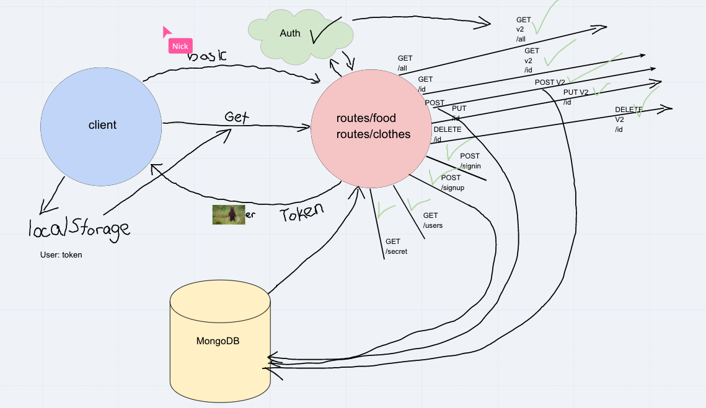

# LAB 08: auth-api

## Author: Jason Quaglia

- [Link to Heroku Deployment](https://auth-api-jquaglia.herokuapp.com/)

- [Link to Github Actions Tab](https://github.com/jquaglia/auth-api/actions)

- [Link to PR on Github](https://github.com/jquaglia/auth-api/pull/1)

## Collaborators

- Jason Dormier

- Carly Dekock

- Nick Magruder

- Bill Moreno

- Seid

## The Setup

### Getting Started

1. Clone down the repository

1. Run the command `npm install`

1. Create a `.env` file with `PORT` and `MONGODB_URI` and `SECRET` variables

### Testing the Server

1. Run the command `npm test` to test the server

### Running the Server

1. To run the server locally, run `nodemon`

1. Open up [swagger](https://inspector.swagger.io/builder) and enter in http://localhost:`PORT`/`route` and test the routes out using proper models for the database

## UML

